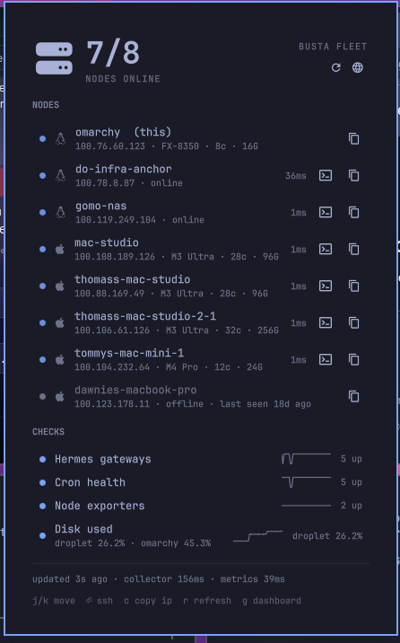

# Fleetbar

**Your fleet's heartbeat in the Omarchy bar.**

Fleetbar watches two things and folds them into one status pill: every machine
on your **Tailscale** tailnet (straight from the local daemon — no API key, no
cloud), and any number of threshold **checks** against a Prometheus-compatible
metrics source (VictoriaMetrics, Prometheus, Thanos, Mimir, ...).



The bar shows `7/8` (nodes online) and appends `!N` when anything needs
attention. Click for the full panel: two-line machine rows — name over
`IP · chip · cores · RAM`, live **latency** per node (`1ms`, or
`23ms · via mia` when traffic falls back to a relay — the anomaly worth
noticing), **last seen** age for offline machines, click-to-copy IPs —
plus every check with a **sparkline trend** (worst-direction fold of the
check's history) and a worst-first headline, and an honest footer with
data age and collection latency.

**It's a sentinel, not just a dashboard**: when the fleet's overall severity
changes — or when the *set of offenders* changes at the same severity, so a
second machine failing during an existing warning still pings — Fleetbar
sends a desktop notification naming exactly what broke, and one when it
recovers.
Notifications are transition-based and flap-guarded (at most one per five
minutes), and a shell restart never re-announces an ongoing incident.
Disable with the `notifyOnChange` setting.

## The honesty contract

Monitoring that fails silently is worse than no monitoring. Fleetbar's
collector treats failure as data:

- A source that can't be reached, a query that errors, or a query that
  returns **no data** renders as `unknown` — never as green.
- Every failure is printed at the **top** of the panel, before any data.
- When the report itself goes stale (collector stopped producing), the bar
  visibly drifts toward the muted shade and the footer says `STALE`.

## Install

```
omarchy plugin add https://github.com/tgomolski-lgtm/fleetbar --enable
```

Dependencies: `python3` (stdlib only) and, for the node list, the `tailscale`
CLI — without it, node status degrades to an explicit "not installed" state
and metric checks still work. Remove with `omarchy plugin remove
stratoforce.fleetbar`; this deletes the plugin folder only and leaves your
`~/.config/fleetbar/config.json` (which Fleetbar reads but never writes).

Then describe your fleet in `~/.config/fleetbar/config.json` (start from
[config.example.json](config.example.json)):

```jsonc
{
  "fleetName": "Homelab",
  "dashboardUrl": "http://grafana.example:3000",   // right-click target
  "tailscale": {
    "hidePatterns": ["^localhost$"],   // regex, matched per node name/host
    "hideOS": ["iOS", "android"],
    "expect": ["server1", "nas"],      // offline+expected = a problem
    "offlineSeverity": "warn"          // or "crit"
  },
  "victoriametrics": { "url": "http://vm.example:8428" },
  "checks": [
    {
      "id": "disk", "name": "Disk used",
      "query": "max by (node) (100 - 100 * node_filesystem_avail_bytes / node_filesystem_size_bytes)",
      "op": ">=", "warn": 85, "crit": 95, "format": "percent"
    }
  ]
}
```

Edits to the config apply live — the panel watches the file.

### Check reference

| Field | Meaning |
|---|---|
| `query` | Any instant-vector PromQL. Multi-series results become one row each. |
| `op` | Breach direction: `>` `>=` `<` `<=` `==` `!=` (default `>=`). |
| `warn` / `crit` | Thresholds; `crit` wins. Omit both for informational checks. |
| `format` | `number`, `percent`, `bytes`, `seconds`, `updown`. |
| `labelKey` | Label naming each series (auto: `node` → `host` → `instance` → `job`). |
| `unit`, `decimals` | Display suffix and precision for `number`. |
| `history` | `false` to skip the sparkline range query for this check. |

### Node identity (optional)

Latency probes run by default (`tailscale ping`, parallel, one per online
peer; disable with `"tailscale": {"latency": false}`). To label each row
with its machine (`M3 Ultra · 32c · 256G`), point `nodeInfo` at inventory
metrics; `aliases` maps the metric's label to the node's exact tailnet
short name (exact match only — substrings would misassign lookalikes):

```jsonc
"nodeInfo": {
  "infoQuery": "fleet_inventory_info",        // reads a `chip` label
  "coresQuery": "fleet_inventory_cpu_cores",
  "memBytesQuery": "fleet_inventory_memory_bytes",
  "labelKey": "asset",
  "aliases": { "Atlas": "my-studio", "Busta": "my-mini" }
}
```

Identity and latency are decoration: a failed probe or query leaves the
field blank, never fakes a value, and never fails the node.

Global history tuning (optional, top-level): `"history": {"enabled": true,
"spanSec": 10800, "points": 40}` — the sparkline is a range query over
`spanSec`, folded across series in the check's worst direction (`min` per
timestep for `<`/`<=` checks, `max` otherwise). History is decoration: a
failed range query degrades to no sparkline, never to a failed check.

### Interactions

| Bar | Effect |
|---|---|
| Click | Toggle the fleet panel |
| Middle click | Force refresh |
| Right click | Open your `dashboardUrl` |

The panel is keyboard-first, like the rest of Omarchy: `j`/`k` (or arrows)
move the cursor through the node rows, `Enter`/`s` opens your default
terminal SSH'd to the selected node, `c` copies its IP, `r` refreshes,
`g` opens the dashboard, `Esc` closes. Each online node also has SSH and
copy buttons. The SSH command is a config template — `"sshCommand":
"ssh {name}"` by default, with `{name}`/`{ip}`/`{host}` placeholders
(split on whitespace; no quoting).

IPC: `qs ipc call stratoforce.fleetbar toggle` (also `open`, `close`, `refresh`).

## Design

- `fleetbar-collector` — a stdlib-only Python 3 script. One run produces one
  JSON report; VM queries run concurrently; every source has its own timeout.
  Exit 0 with in-band errors whenever a report exists at all.
- `Panel.qml` owns the collector process and all state (the first-party
  weather plugin's pattern); `BarWidget.qml` is a thin host; `Model.js` is
  pure functions.
- Theming comes entirely from Omarchy's `Color`/`Style` tokens — severity is
  a blend between your theme's foreground and urgent colors, so it stays
  legible in every theme, and issue counts are always also written as text
  (`!2`), never color alone.

## Tests

```
python3 tests/test_collector.py   # 32 tests: sources, severity, formats, failure paths
node tests/run-model-tests.mjs    # 13 tests: pure view-model helpers
```

## License

MIT
